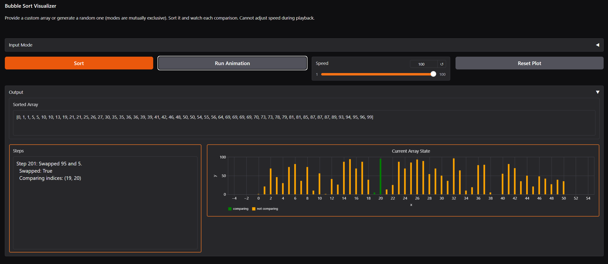

# Hi, Hallo! 🇩🇪

*Pursuing my lifelong goal of making computers do things so I don't have to*

## My Skills 🛠️

## About Me 💭
- Black belt instructor 🥋 : I've spent years teaching children and adults martial arts, which not only has helped me stay in shape, but has also helped me gain invaluable skills working with people from various walks of life

## Featured Projects

📊 **Gradio Sorting Project** - (https://github.com/waffleshd/gradio-sort-project)

Originally my final project for my computing class, this project visually displays how bubble sort (my personal fave based on looks) works. It also taught me how to use gradio, which I will definitely be using more in any future AI projects.

🐤 **Flappy Bird AI** - (https://github.com/waffleshd/NEAT-Flappy-Bird)

Flappy bird is too difficult, so I built my own version of it and then set a neural net loose on it. Jokes aside, this is pretty much my first honest attempt to build an AI that actually has some use.

Watch it at work: https://youtu.be/1FoqGZJ0d1U

🏕️ **Camping Game** - (https://github.com/waffleshd/camping_game)

Unfinished demo for a camping game I had envisioned using Godot. Even though the game is not finished, it helped me learn about Github, and cemented various other OOP ideas for me. 

