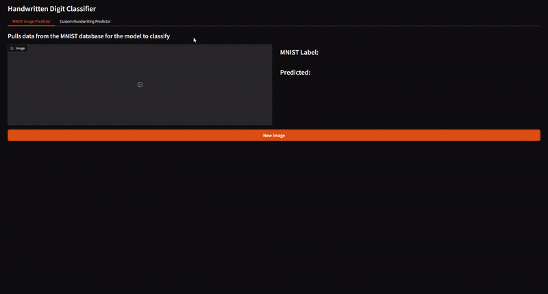
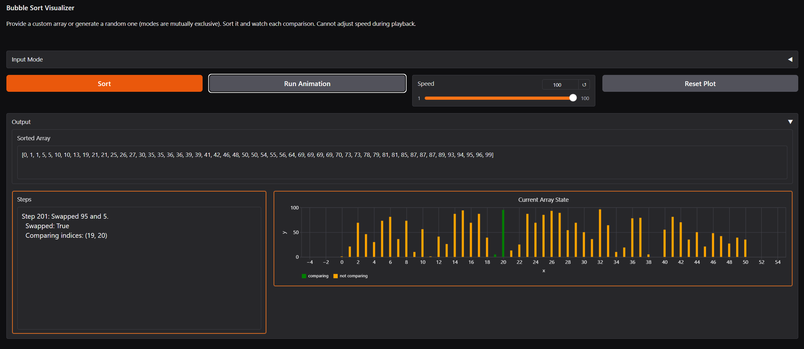

# Hi, Hallo! 🇩🇪

*Pursuing my lifelong goal of making computers do things so I don't have to*

## My Skills 🛠️

## Featured Projects

🔢 **Digit Eye** - (https://github.com/waffleshd/digit-eye)

Built a convolutional neural network trained on MNIST data (a collection of 60,000 handwritten digits) to be able to classify new, custom handwritten digits. Check it out on hugging face [here!](https://huggingface.co/spaces/waffleshd/digit-eye)

☁️ **Weather App** - (https://github.com/waffleshd/weather-app)

A simple weather app with current weather data, 5-day forecast, and SQLite implementation to store historical weather data. 

📊 **Gradio Sorting Project** - (https://github.com/waffleshd/gradio-sort-project)

Originally my final project for my computing class, this project visually displays how bubble sort (my personal fave based on looks) works. It also taught me how to use gradio, which I will definitely be using more in any future AI projects.

🐤 **Flappy Bird AI** - (https://github.com/waffleshd/NEAT-Flappy-Bird)

Flappy bird is too difficult, so I built my own version of it and then set a neural net loose on it. I used NEAT (neuroevolution of augmented topology), an evolutionary algorithm to learn to play flappy bird. In the end, it was able to play so well that it never loses.

Watch it at work: https://youtu.be/1FoqGZJ0d1U
